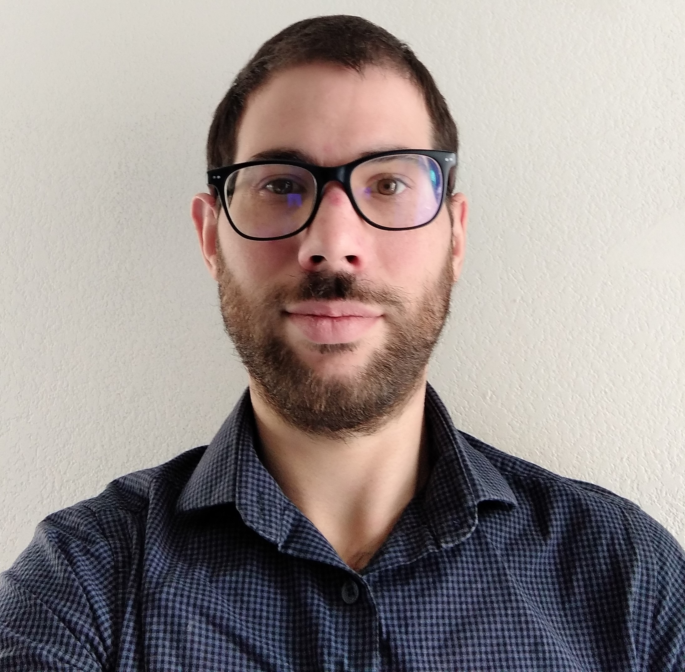

# cv-dev-web
<!DOCTYPE html>
  <html>
    <head>
      <title>SEQUEIRA Alexandre</title>
        <meta charset="utf-8">
       
        <link type="text/CSS" rel="stylesheet" href="CSSCV.CSS">
               <!-- faire commetaire-->
    </head>
    <body>
      
      <table class="table">
  <thead>
     <tr class="bordure">
       <th>
 
</th>
        <th class="intituler"><h1>Développeur web et mobile</h1> <h2 class="nom" >Sequeira Alexandre</h2> </th>
    </tr>
  
    <tr class="informations">
      <th class="gauche"  valign="top"> 

       7 impasse du puiseur  69008 LYON  
      0628657515  
     alexandre.sequeira01@gmail.com  Permis B
</th>
         <th class="un">
          <h2>Ma formation</h2>
        <ul>
           <li>CACES (Certificat d'aptitude à la conduite en sécurité) 1,3 et 5 2019</li>
           <li>IFSI (Instutut de formation en soins infirmiers) durant 2 ans dont obtention du diplôme d'aide soignant en 2014</li>
          <li>Un semestre en IUT informatique 2010</li>
          <li>Bac scientifique en 2010</li>  
         </ul>
               
         <h2>Mes expériences</h2>
        <ul>
          <li>Janvier à mars 2020 : assistant chef de quai avec utilisation de SAP à Safram Genas (69).
           Gérer les chauffeurs, transmissions des informations aux bureaux et siège social, contrôle des camions et des marchandises.</li>
          <li> Avril 2019 à décembre 2019: Cariste CACES 1,3 et 5 dans différentes entrerpises autour de Lyon. 
          Préparation de commande, organisation de l'espace de stockage, vider ou remplir les camions.</li>
          <li>Août à fin décembre 2018 : facteur sur Lyon 8. Trier le courrier, organiser ça tournée, distribution du courrier et des colis.</li>
          <li>Janvier à fin juin 2018 : roadtrip en solitaire en Amérique du Sud. Dont deux période de volontariat
          dans des auberges de jeunesse  à Medellin (en Colombie) et a Florianopolis (au Brésil). 
          Apprentissage de l'espagnole, adaptation aux diférentes cultures et habitudes, être autonôme.</li>
          <li>Septembre 2015 à septembre 2016 puis de janvier 2017 à janvier 2018 : différentes missions comme aide-soignant sur Lyon et sa périphérie.
           Pordiguer les soins de confort, être à l'écoute des patients et des familles, former les stagiaires, transmettre les informations à l'équipe  soignante,
          organisé son tour de soin et n'ayant pas eu de place fixe s'adapter à chaque type de service rapidement.</li>
        </ul>
        
       

       

       <h2>Hard skills</h2>
        <ul class="liste">
          <li>  <label for="file"></label>
<progress id="file" value="25" max="100"> 25% </progress></li>
          <li>  <label for="file"></label>
<progress id="file" value="25" max="100"> 25% </progress> </li>
          <li>  <label for="file"></label>
<progress id="file" value="75" max="100"> 75% </progress> </li>
          <li>  <label for="file"></label>
<progress id="file" value="65" max="100"> 65% </progress> </li>
        </ul>
       

        
       

        <h2>Soft skills</h2>
        <ul class="liste">
          <li>Esprit d'équipe </li>
          <li>Empathique.</li>
          <li>Bonne communication</li>
        </ul>
        

    

       <h2>Mad skills</h2>
       <ul class="liste">
      <li> </li>
      <li></li>
       <li></li>
       <li></li>
       <ul></ul>
       

      
       
        </th>
       
        
    </tr>
         </body>
  </html> 
